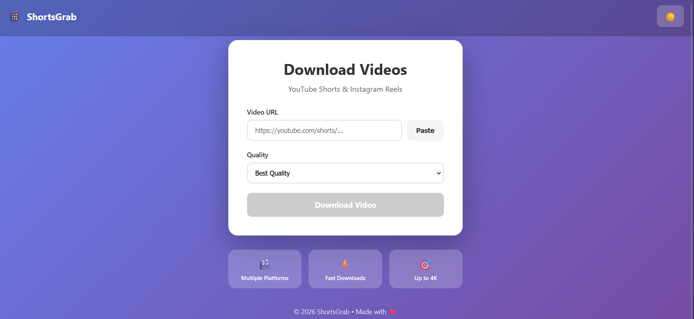

# 📱 ShortsGrab

> Download videos from YouTube and Instagram in multiple quality options (360p to 4K)

[](https://opensource.org/licenses/MIT)
[](https://www.docker.com/)
[](http://makeapullrequest.com)

---

## ✨ Features

- 🎬 **Multiple Platforms** - YouTube & Instagram support
- ⚡ **Fast Streaming** - Zero-disk downloads, direct streaming
- 🎯 **Quality Options** - 360p, 480p, 720p, 1080p, 4K
- 📱 **Responsive Design** - Beautiful UI on mobile and desktop
- 🔒 **Rate Limited** - Built-in protection against abuse (10 req/min)
- 🐳 **Docker Ready** - One-command deployment
- 🎨 **Modern UI** - Gradient backgrounds, smooth animations
- 📦 **Zero Storage** - Videos stream directly, no server storage needed

---

## 🚀 Quick Start

### Prerequisites

- [Docker](https://www.docker.com/) & Docker Compose
- Git

### Installation
```bash
# Clone the repository
git clone https://github.com/Bhaskar-Praveen/ShortsGrab.git
cd ShortsGrab

# Copy environment file
cp .env.example .env

# Build and start (first time takes ~5 minutes)
docker-compose up --build

# Or run in background
docker-compose up -d
```

**That's it!** Visit **http://localhost:8080** 🎉

---

## 🎯 Usage

1. **Paste a URL** - YouTube or Instagram video link
2. **Select Quality** - Choose from 360p to 4K
3. **Download** - Click the button and enjoy!

### Supported Platforms

| Platform | Video Types | Max Quality |
|----------|-------------|-------------|
| YouTube | Shorts, Regular Videos | 4K (2160p) |
| Instagram | Reels, Posts | 1080p |

---

## 🛠️ Configuration

Edit `.env` file to customize:
```env
# Backend port
PORT=4000

# Environment
NODE_ENV=production

# Rate limiting (requests per minute per IP)
RATE_LIMIT_MAX=10

# CORS allowed origins (comma-separated)
ALLOWED_ORIGINS=http://localhost:8080,https://yourdomain.com
```

---

## 📦 Tech Stack

**Frontend:**
- React 19 + TypeScript
- Vite (build tool)
- TailwindCSS (styling)
- Modern responsive design

**Backend:**
- Node.js + Express
- yt-dlp (download engine)
- ffmpeg (video processing)
- Rate limiting & CORS protection

**DevOps:**
- Docker & Docker Compose
- Nginx (reverse proxy)
- Alpine Linux (lightweight containers)

---

## 🏗️ Project Structure
```
ShortsGrab/
├── backend/
│   ├── src/
│   │   └── server.js          # Express API with yt-dlp
│   ├── Dockerfile
│   └── package.json
├── frontend/
│   └── shortsgrab/
│       ├── src/
│       │   ├── App.tsx         # Main app component
│       │   ├── components/     # React components
│       │   └── utils/          # Helper functions
│       ├── Dockerfile
│       ├── nginx.conf          # Nginx configuration
│       └── package.json
├── docker-compose.yml          # Orchestration
├── .env.example                # Environment template
├── .gitignore
├── LICENSE
└── README.md
```

---

## 🔒 Security Features

- ✅ **Rate Limiting** - 10 requests per minute per IP
- ✅ **CORS Protection** - Whitelist-based origin control
- ✅ **Input Validation** - Strict URL validation
- ✅ **File Size Limits** - Max 500MB per download
- ✅ **No API Keys** - Works without authentication
- ✅ **Process Isolation** - Docker containerization

---

## 🚢 Deployment

### Docker Compose (Production)
```bash
# Build production images
docker-compose -f docker-compose.yml up --build -d

# View logs
docker-compose logs -f

# Stop services
docker-compose down
```

### Manual Deployment

**Backend:**
```bash
cd backend
npm install
PORT=4000 node src/server.js
```

**Frontend:**
```bash
cd frontend/shortsgrab
npm install
npm run build
# Serve the 'dist' folder with any static server
```

---

## ⚠️ Disclaimer

**Important:** This tool is designed for downloading publicly accessible content only. 

- ✅ Use for personal backups
- ✅ Download your own content
- ✅ Educational purposes
- ❌ Do not violate copyright laws
- ❌ Do not bypass DRM or paywalls
- ❌ Respect content creators' rights

**Users are responsible for complying with:**
- YouTube Terms of Service
- Instagram Terms of Service
- Local copyright laws
- Platform-specific policies

---

## 🤝 Contributing

Contributions are welcome! Here's how:

1. Fork the repository
2. Create a feature branch (`git checkout -b feature/amazing-feature`)
3. Commit changes (`git commit -m 'Add amazing feature'`)
4. Push to branch (`git push origin feature/amazing-feature`)
5. Open a Pull Request

### Development Setup
```bash
# Install dependencies
cd backend && npm install
cd ../frontend/shortsgrab && npm install

# Run in development mode
docker-compose -f docker-compose.dev.yml up
```

---

## 📝 License

This project is licensed under the **MIT License** - see the [LICENSE](LICENSE) file for details.

---

## 🙏 Acknowledgments

- [yt-dlp](https://github.com/yt-dlp/yt-dlp) - Powerful video download engine
- [ffmpeg](https://ffmpeg.org/) - Video processing toolkit
- Built with ❤️ for content creators and developers

---

## 📧 Contact

**Bhaskar Praveen** - [@Bhaskar-Praveen](https://github.com/Bhaskar-Praveen)

Project Link: [https://github.com/Bhaskar-Praveen/ShortsGrab](https://github.com/Bhaskar-Praveen/ShortsGrab)

---

## ⭐ Star History

If you find this project useful, please consider giving it a star! ⭐

---

<div align="center">
  Made with ❤️ by <a href="https://github.com/Bhaskar-Praveen">Bhaskar Praveen</a>
</div>

## 📸 Screenshot



---

## 🎨 Features Showcase

- **Beautiful UI**: Modern gradient design with smooth animations
- **One-Click Paste**: Quick clipboard access
- **Smart Detection**: Automatically detects YouTube & Instagram links
- **Multiple Qualities**: Choose from 360p to 4K
- **Theme Toggle**: Switch between light and dark modes
- **Breathing Exercise**: Relaxing animation while downloading
- **Mobile Friendly**: Fully responsive design
